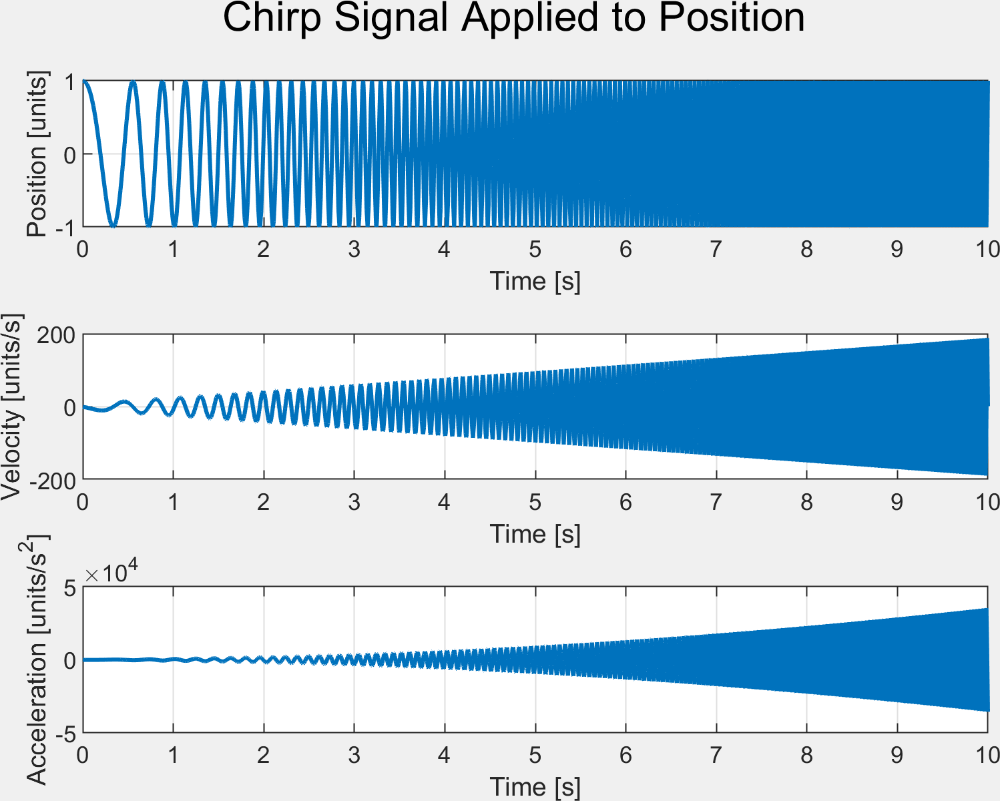
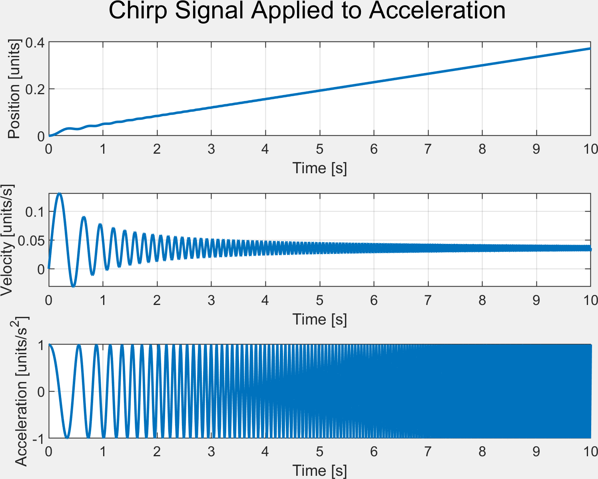

# 📦 FB_ChirpSignal – Chirp Signal Generator for PLC Applications

## 🧩 Overview

`FB_ChirpSignal` is a function block implemented in Structured Text (ST) for generating **chirp signals** in real-time, supporting both **linear** and **logarithmic** frequency sweeps. It also calculates the **first** and **second** time derivatives and integrals of the signal

It is compatible with PLCOpen XML standard.

---

## ⚙️ Features

- ✅ Supports both **linear** and **logarithmic** chirp modes
- ✅ Outputs:
  - The chirp signal applied to signal, or its first or second derivatives.
  - Current frequency and elapsed time
- ✅ Resettable and re-triggerable
- ✅ Suitable for **cyclic PLC tasks**

---

## 🧮 Interface

### ➤ Inputs (`VAR_INPUT`)

| Name        | Type    | Description                                                 |
|-------------|---------|-------------------------------------------------------------|
| `Start`     | `BOOL`  | Start the chirp signal generation                           |
| `Reset`     | `BOOL`  | Reset the signal and internal time                          |
| `Amplitude` | `LREAL` | Amplitude of the output signal                              |
| `FreqStart` | `LREAL` | Starting frequency in Hz                                    |
| `FreqEnd`   | `LREAL` | Ending frequency in Hz                                      |
| `Duration`  | `LREAL` | Duration of the chirp signal (s)                            |
| `Ts`        | `LREAL` | Sampling time (e.g., PLC cycle time)                        |
| `UseLog`    | `BOOL`  | `TRUE` = logarithmic chirp, `FALSE` = linear chirp          |
| `UseAcc`    | `BOOL`  | Use second-order integration (for acceleration input)       |
| `UseVel`    | `BOOL`  | Use first-order integration (for velocity input)            |
| `gain`      | `LREAL` | Gain factor used when compensating bias (if `UseAcc`)       |

---

### ➤ Outputs (`VAR_OUTPUT`)

| Name         | Type    | Description                                           |
|--------------|---------|-------------------------------------------------------|
| `t`          | `LREAL` | Elapsed time since chirp start                        |
| `SignalOut`  | `LREAL` | Output signal value (chirp)                           |
| `SignalDot`  | `LREAL` | First derivative (velocity)                           |
| `SignalDDot` | `LREAL` | Second derivative (acceleration)                      |
| `Done`       | `BOOL`  | TRUE when `t >= Duration` (chirp finished)            |
| `frequency`  | `LREAL` | Instantaneous frequency (Hz) at current `t`           |

---

## 🚀 Example Usage

### 1. **Basic Linear Chirp**

```pascal
fbChirp(
    Start := TRUE,
    Reset := FALSE,
    Amplitude := 1.0,
    FreqStart := 1.0,
    FreqEnd := 10.0,
    Duration := 5.0,
    Ts := 0.01,
    UseLog := FALSE,
    UseAcc := FALSE,
    UseVel := FALSE,
    gain := 0.1
);
```

Generates a 5-second **linear** chirp from 1 Hz to 10 Hz with 1.0 amplitude.

---

### 2. **Logarithmic Chirp with Velocity Output**

```pascal
fbChirp(
    Start := TRUE,
    Reset := FALSE,
    Amplitude := 2.0,
    FreqStart := 0.5,
    FreqEnd := 50.0,
    Duration := 10.0,
    Ts := 0.002,
    UseLog := TRUE,
    UseAcc := FALSE,
    UseVel := TRUE,
    gain := 0.0
);
```

Produces a logarithmic chirp for system excitation, applied to **velocity** (first derivative), the signal is compute by integration.

---

### 3. **Acceleration Input with Bias Compensation**

```pascal
fbChirp(
    Start := TRUE,
    Reset := FALSE,
    Amplitude := 0.8,
    FreqStart := 2.0,
    FreqEnd := 20.0,
    Duration := 3.0,
    Ts := 0.005,
    UseLog := FALSE,
    UseAcc := TRUE,
    UseVel := FALSE,
    gain := 0.05
);
```

---

## 🧠 Tips

- Call the function block **cyclically** (e.g., from a task running every `Ts` seconds).
- Use `Reset := TRUE` to restart the chirp cleanly.
- Watch for `Done = TRUE` to know when the chirp finishes.
- The signal is **continuous and smooth**, designed for physical system excitation.


- if UseVal:=False and UseAcc:=False
.

- if UseVal:=True
.

- if UseVal:=False and UseAcc:=True
.

---

## 🧑‍💻 Author

**Manuel Beschi**  
Joint Robotics Lab (JRL) - CARI  
University of Brescia  
cari.unibs.it
