# 🦾 TwinCAT Chirp Test Program

This program implements a **fully automated chirp-based experiment** on a motion axis in a TwinCAT PLC environment. It is designed to command a robot or actuator with a frequency-sweeping signal and log its response in real-time for system identification or diagnostics.

---

## 🎯 Purpose

- Generate a **chirp signal** (either linear or logarithmic) as an external setpoint.
- Apply this signal to a TwinCAT-controlled motion axis.
- **Log feedback data** (position, velocity, torque) in a binary file.
- Execute the whole cycle **automatically** through a state machine, ensuring safety and repeatability.

---

## 🔄 Finite State Machine Overview

The program logic is organized around a **finite state machine (FSM)** to control the sequence of operations.





### FSM States:

| State             | Description                                                                 |
|------------------|-----------------------------------------------------------------------------|
| `None`           | Idle state; waits for the start trigger.                                    |
| `Init`           | Powers on the axis using `MC_Power`.                                        |
| `StartingMotor`  | Sets the axis to zero, enables ext. setpoint mode, resets the chirp block.  |
| `OpeningFile`    | Waits for the logger to open the file.                                      |
| `Chirp`          | Feeds chirp signal to axis, logs feedback using `FB_DataLogger`.            |
| `Saving`         | Triggers logger to close the file.                                          |
| `SlowingDown`    | Allows system to coast down below a velocity threshold.                     |
| `Stopping`       | Powers off the axis safely.                                                 |

---

## 🧠 Key Components

### Motion Blocks
- `MC_Power`, `MC_SetPosition`: Axis initialization
- `MC_ExtSetPointGenEnable`, `MC_ExtSetPointGenFeed`: Setpoint control
- `FB_ChirpSignal`: Chirp signal generator [`see README`](../Function%20Blocks/FB_ChirpSignal.md)
- `FB_DataLogger`: Binary file logger (with timestamped samples) [`see README`](../Function%20Blocks/FB_DataLogger.md)

### Variables of Interest
- `act_pos`, `act_vel`, `act_torque`: Axis feedback
- `chirp.SignalOut`, `.SignalDot`, `.SignalDDot`: Command signals
- `running`, `stopping`: Public flags for monitoring status


### DUTs
- `E_state` defined [here](../DUTs/ChirpTaskE_State.xml)
---

## 🧪 How It Works

1. User triggers the experiment using `bStart`.
2. The system powers the axis, sets position to zero.
3. Chirp generator is configured and started.
4. During the experiment:
   - A new position/velocity/acceleration setpoint is sent every cycle.
   - Axis state is logged in real time.
5. After the chirp ends:
   - The system disables external control.
   - The axis is allowed to stop naturally.
   - The drive is powered off.

---

## 📁 Logged Data Format

Data is saved as binary with structure: `ARRAY[1..4] OF LREAL`
1. Time (`chirp.t`)
2. Position (`act_pos`)
3. Velocity (`act_vel`)
4. Torque (`act_torque`)

You can read the file using MATLAB or Python (see README for [`FB_DataLogger`](../Function%20Blocks/FB_DataLogger.md)).

---

## 📍 File Location

Binary log files are written to the location:
```plaintext
C:\Users\Administrator\Documents\binari\test1.bin
```

Modify the `sFileName` variable to change this path.

---

## 👤 Author

**Manuel Beschi**  
Joint Robotics Lab (JRL) – CARI  
University of Brescia  
cari.unibs.it
